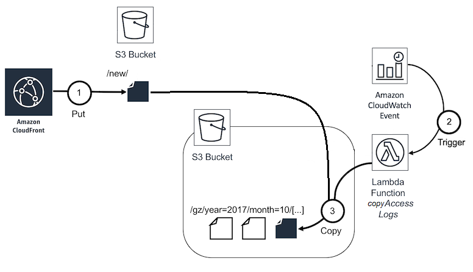

# Analyzing your Amazon CloudFront access logs at scale

This is a sample implementation for the concepts described in the AWS blog post [_Analyze your Amazon CloudFront access logs at scale_](https://aws.amazon.com/blogs/big-data/analyze-your-amazon-cloudfront-access-logs-at-scale/) using
[AWS CloudFormation](https://aws.amazon.com/cloudformation/),
[Amazon Athena](https://aws.amazon.com/athena/),
[AWS Glue](https://aws.amazon.com/glue/),
[AWS Lambda](https://aws.amazon.com/lambda/), and
[Amazon Simple Storage Service](https://aws.amazon.com/s3/) (S3).

This fork alters the [original implementation](https://github.com/aws-samples/amazon-cloudfront-access-logs-queries) by allowing access logs being processed from a bucket not managed by the stack and have a few other parameters.

## Overview

The application has two main parts:

- An S3 bucket `ProcessedAccessLogsBucketName` that receives copies of access logs sent to another (already existing) bucket for Amazon CloudFront access logs. Hourly an event triggers the AWS Lambda function `copyAccessLogs` that copies access logs from the previous hour from the original bucket to an [Apache Hive style](https://cwiki.apache.org/confluence/display/Hive/LanguageManual+DDL#LanguageManualDDL-AlterPartition) prefix in the bucket managed by the stack.

    

- An hourly scheduled AWS Lambda function `transformPartition` that runs an [INSERT INTO](https://docs.aws.amazon.com/athena/latest/ug/insert-into.html) query on a single partition per run, taking one hour of data into account. It writes the content of the partition to the Apache Parquet format into the `ProcessedAccessLogsBucketName` S3 bucket.

    

## FAQs

### Q: How can I customize and deploy the template?

1. [Fork](https://github.com/aws-samples/amazon-cloudfront-access-logs-queries#fork-destination-box) this GitHub repository.
2. Clone the forked GitHub repository to your local machine.
3. Modify the templates.
4. Install the [AWS CLI](https://docs.aws.amazon.com/cli/latest/userguide/installing.html)
    & [AWS Serverless Application Model (SAM) CLI](https://docs.aws.amazon.com/serverless-application-model/latest/developerguide/serverless-sam-cli-install.html).
5. Validate your template:

    ```sh
    $ sam validate -t template.yaml
    ```

6. Package the files for deployment with SAM (see [SAM docs](https://docs.aws.amazon.com/serverless-application-model/latest/developerguide/serverless-deploying.html) for details) to a bucket of your choice. The bucket's region must be in the region you want to deploy the sample application to:

    ```sh
    $ sam package
        --template-file template.yaml
        --output-template-file packaged.yaml
        --s3-bucket <BUCKET>
    ```

7. Deploy the packaged application to your account:

    ```sh
    $ aws cloudformation deploy
        --template-file packaged.yaml
        --stack-name my-stack
        --capabilities CAPABILITY_IAM
        --parameter-overrides CloudFrontAccessLogsBucketName=cf_logs_bucket CloudFrontDistributionId=cf_distribution_id ProcessedAccessLogsBucketName=my-bucket GlueDatabaseName=db_name
    ```

The following parameters must be provided:

- `CloudFrontAccessLogsBucketName`: Bucket where access logs are delivered from CloudFront. This bucket is not created nor managed by this stack;
- `CloudFrontDistributionId`: The CloudFront distribution ID from which logs will be fetched. This is necessary to match the filenames of access logs to be copied;
- `ProcessedAccessLogsBucketName`: Name of the bucket that this stack will create and host the partitioned logs (both in gz and parquet format);
- `GlueDatabaseName`: Already existing Glue Database on which the new Tables managed by the stack will be created.

You can also override other parameters during deployment:

- `NewKeyPrefix` (default: `new/`) is the S3 prefix that is used in the configuration of your Amazon CloudFront distribution for log storage. The AWS Lambda function will copy the files from here in the "CloudFrontAccessLogsBucket";
- `GzKeyPrefix` (default: `partitioned-gz/`) and `ParquetKeyPrefix` (default: `partitioned-parquet/`) are the S3 prefixes for partitions that contain gzip or Apache Parquet files in the "ProcessedAccessLogsBucket";
- `TableNamePrefix` (default: `cf_logs`) is a prefix that is used for the Tables created to give more context and prevent naming collisions.

### Q: How can I query data?

After 0-1 hour Amazon CloudFront delivers new access logs, files will be copied to `GzKeyPrefix`. After 1-2 hours, they will be transformed to files in `ParquetKeyPrefix`.

You can query your access logs at any time in the [Amazon Athena Query editor](https://console.aws.amazon.com/athena/home#query) using the AWS Glue view called `<TableNamePrefix>_combined` in the `<GlueDatabaseName>` database:

```sql
SELECT * FROM glue_db.cf_logs_combined limit 10;
```

### Q: How can I use the sample application for multiple Amazon CloudFront distributions?

Deploy another AWS CloudFormation stack from the same template to create a new bucket for different distributions or environments. You can override the stack parameters for customization on each deployment.

### Q: How can I add a new question to this list?

If you found yourself wishing this set of frequently asked questions had an answer for a particular problem, please [submit a pull request](https://help.github.com/articles/creating-a-pull-request-from-a-fork/). The chances are good that others will also benefit from having the answer listed here.

### Q: How can I contribute?

See the [Contributing Guidelines](https://github.com/aws-samples/amazon-cloudfront-access-logs-queries/blob/mainline/CONTRIBUTING.md) for details.

## License Summary

This sample code is made available under a modified MIT license. See the [LICENSE](https://github.com/aws-samples/amazon-cloudfront-access-logs-queries/blob/mainline/LICENSE) file.
